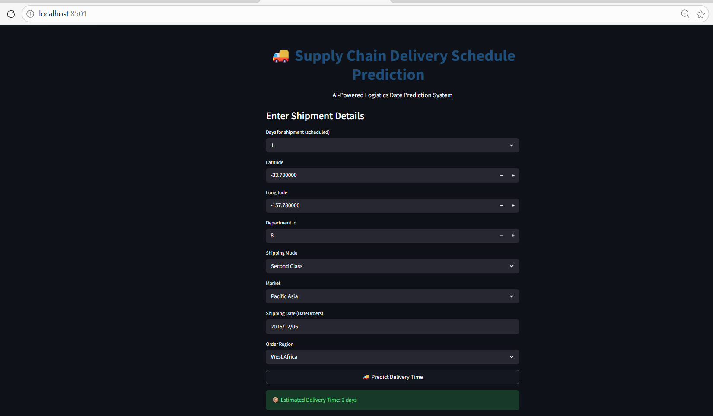

🚚 Supply Chain Delivery Schedule Prediction

This project is a Machine Learning-based logistics prediction system developed to estimate real shipping delivery days using supply chain and shipment-related data.

📌 Project Overview

The model predicts actual shipping delivery days based on shipment details, logistics information, market region, shipping mode, and scheduling data. The aim of the project is to improve delivery planning and logistics decision-making using Machine Learning techniques.

🔹 Features

- Data preprocessing and feature engineering
- One-Hot Encoding (OHE)
- Date feature extraction
- Hyperparameter tuning for model optimization
- Random Forest Regressor model implementation
- Interactive Streamlit web application deployment

🛠 Technologies Used

- Python
- Pandas
- NumPy
- Scikit-learn
- Streamlit
- Matplotlib
- Seaborn

📊 Machine Learning Models Used

- Random Forest Regressor
- Gradient Boosting
- Decision Tree
- XGBoost

🚀 Streamlit Application

The project includes an interactive Streamlit web application that allows users to enter shipment details and predict estimated real delivery days in real time.

📷 Project Screenshot

👥 Team Project Leadership

Led a group project focused on Supply Chain & Logistics Analytics, coordinating project development, Machine Learning model building, preprocessing workflows, and Streamlit application integration while collaborating with team members throughout the project lifecycle.
